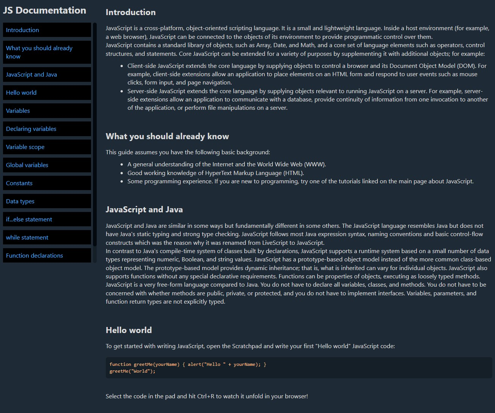

# freecodecamp Technical Documentation Page - solution

## Welcome! 👋

Thanks for checking out this project!

This is a solution for a freecodecamp challenge that consists on building a documentation Pagee that looks as close to the given design as possible. The goal is to improve my web layout skills by building a realistic project.

### Built with
- HTML5
- CSS
- Water.css

### Continued development
- fix sidebar
- if you have any idea of issue with this project or have any question  feel free to contact me

## Author
- Twitter - [@joseph2s5](https://www.twitter.com/joseph2s5)